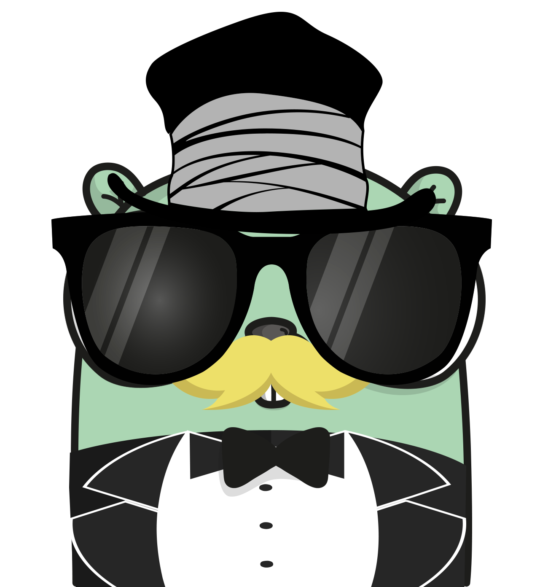
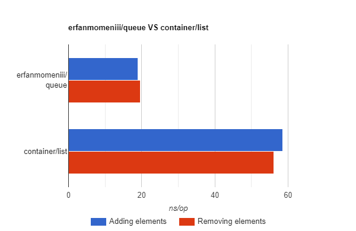

<p align="center">

</p>
<p align="center">
<a href="https://pkg.go.dev/github.com/mehditeymorian/koi/v3?tab=doc"target="_blank">
    
</a>


</p>

# queue 
queue is a lightweight package for having queue and deque in Go.
it performs better than the built-in [container/list](https://golang.org/pkg/container/list/) package for any operation.

# Documentation

## Install

```bash
go get github.com/erfanmomeniii/queue
```   

Next, include it in your application:

```bash
import "github.com/erfanmomeniii/queue"
``` 

## Quick Start
The following example illustrates how to use this package for creating an instance and performing any operation with it:
```go
package main

import (
	"fmt"
	"github.com/erfanmomeniii/queue"
)

func main() {
	q := queue.New()
	q.PushFront(1)
	q.PushFront("hi")
	q.PushBack(3.14)
	// q => [ "hi", 1, 3.14]

	fmt.Println(q.Front())
	// hi
	fmt.Println(q.Back())
	// 3.14

	q.PopBack()
	q.PopFront()
	fmt.Println(q.Front())
	// 1
}

```
## Usage

#### type Queue
```go
type Queue struct {
	front *Node
	back  *Node
}
```
Queue is an instantiation of the queue.

#### func New
```go
func New() *Queue
```
New creates a new instance of a queue.

#### func PushFront
```go
func (q *Queue) PushFront(value any)
```
PushFront adds a new element at the beginning of the queue.

#### func PushBack
```go
func (q *Queue) PushBack(value any)
```
PushBack adds a new element at the end of the queue.

#### func PopFront
```go
func (q *Queue) PopFront() (value any)
```
PopFront retrieves and removes the value of the first element in the queue.

#### func PopBack
```go
func (q *Queue) PopBack() (value any)
```
PopBack retrieves and removes the value of the last element in the queue.

#### func Front
```go
func (q *Queue) Front() (value any)
```
Front returns the value of front elements of the queue.

#### func Back
```go
func (q *Queue) Back() (value any)
```
Back returns the value of last elements of the queue.

## Benchmarks
```
$ cd benchmarks
$ go test -bench .
```
<p align="center">

</p>

## Contributing
Pull requests are welcome. For changes, please open an issue first to discuss what you would like to change.
Please make sure to update tests as appropriate.
